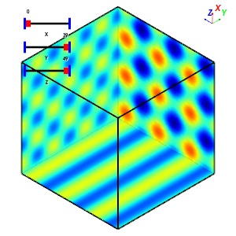
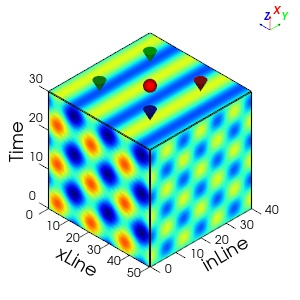

# Slice3d

3D slice visualization with VTK.

## Installation

```bash
pip install vtk-slice3d
```

## Example

```python
import numpy as np
from slice3d import Slice3d, SceneViewer

# ----- 制作示例数据 Make demo data -----
def make_demo_data(nx, ny, nz):
    x = np.linspace(-1, 1, nx)
    y = np.linspace(-1, 1, ny)
    z = np.linspace(-1, 1, nz)
    X, Y, Z = np.meshgrid(x, y, z, indexing='ij')
    data = (np.sin(3*np.pi*X) * np.cos(3*np.pi*Y) +
            np.sin(3*np.pi*Z) +
            np.exp(-(X**2 + Y**2 + Z**2)*4))
    return data.astype(np.float32)

nx, ny, nz = 31, 41, 51
data = make_demo_data(nx, ny, nz)

# ----- 快速浏览3D数据 Quickly browse 3D data -----
s = Slice3d(data,win_size=(300,300))
s.show()
# s.show('demo1.jpg')  # Save

# ----- 精细绘图 Fine drawing -----
sv = SceneViewer(data, win_size=(300, 300))
sv.add_slice(0, 30)
sv.add_slice(1, 0)
sv.add_slice(2, 0)
sv.add_sphere(center=(1.1, 0, 0), radius=0.1)
sv.add_cone(tip=(1, 0.5, 0.5), direction=(-1, 0, 0), height=0.2, radius=0.1, lightingoff=True)
sv.add_cone(tip=(1, 0.5, -0.5), c=(0.8, 0.1, 0.1), direction=(-1, 0, 0), height=0.2, radius=0.1)
sv.add_cone(tip=(1, -0.5, 0.5), c=(0.1, 0.8, 0.1), direction=(-1, 0, 0), height=0.2, radius=0.1)
sv.add_cone(tip=(1, -0.5, -0.5), c=(0.1, 0.1, 0.8), direction=(-1, 0, 0), height=0.2, radius=0.1)
sv.add_axis_ticks(0, 2, [0, 10, 20, 30], ['0', '10', '20', '30'], axis_pos=(-1, 1), label_offset=(0, -0.1, 0.3),
                  title='Time', title_ha='center', title_va='bottom', title_offset=(0, -0.1, 0.35), title_angle=90)
sv.add_axis_ticks(1, 2, [0, 10, 20, 30, 40], ['0', '10', '20', '30', '40'], axis_pos=(-1, -1),
                  label_offset=(0, 0, -0.3), plus_dir=False, title='inLine', title_ha='center', title_va='top',
                  title_offset=(0, 0, -0.4), title_angle=30)
sv.add_axis_ticks(2, 1, [0, 10, 20, 30, 40, 50], ['50', '40', '30', '20', '10', '0'], axis_pos=(-1, -1),
                  label_offset=(0, -0.45, 0), plus_dir=False, title='xLine', title_ha='right', title_va='top',
                  title_offset=(0, -0.5, 0), title_angle=-30)
sv.show()
# sv.show('demo2.jpg')  # Save
```

# Demo Result




# Supported Output Formats

* 位图(PNG、JPG): 默认 DPI = 96，无法修改
* 矢量图(PDF、SVG、EPS): 推荐使用 PDF 或 SVG 保存结果
